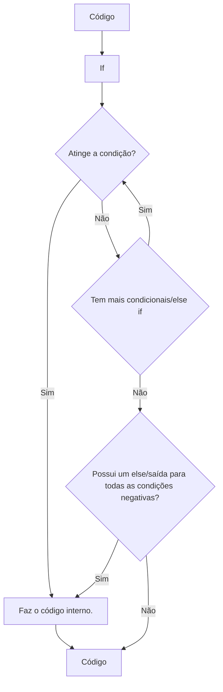

```mermaid
flowchart TD
	A["Código"] --> B[If]
	B --> C{"Atinge a condição?"}
	C -- Sim --> D["Faz o código interno."]
	C -- Não --> E{"Tem mais condicionais/else if"}
	E -- Sim --> C
	E -- Não --> F{"Possui um else/saída para todas as condições negativas?"}
	F -- Sim --> D
	F -- Não --> G["Código"]
	D --> G
```
