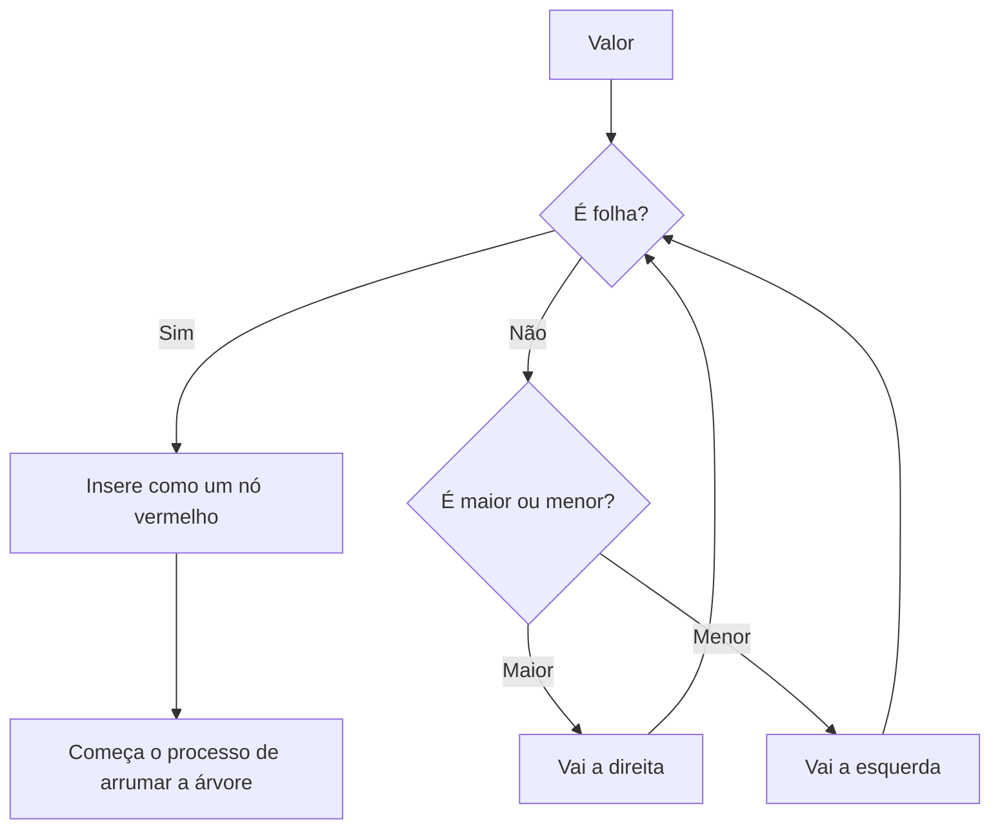

# Inserção

```mermaid
flowchart TD
	A["Valor"] --> B{"É folha?"}
	B -- Sim --> C["Insere como um nó vermelho"]
	C --> G["Começa o processo de arrumar a árvore"]
	B -- Não --> D{"É maior ou menor?"}
	D -- Maior --> E["Vai a direita"]
	D -- Menor --> F["Vai a esquerda"]
	E --> B
	F --> B
```
