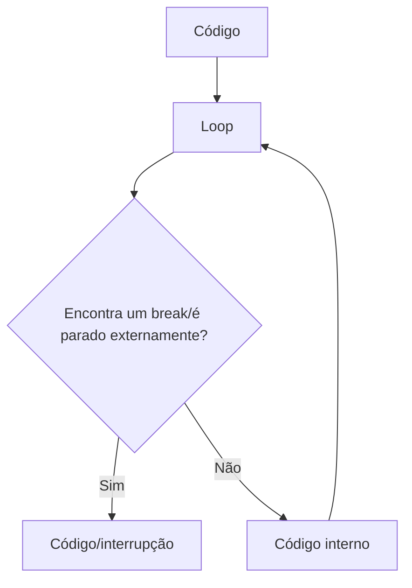
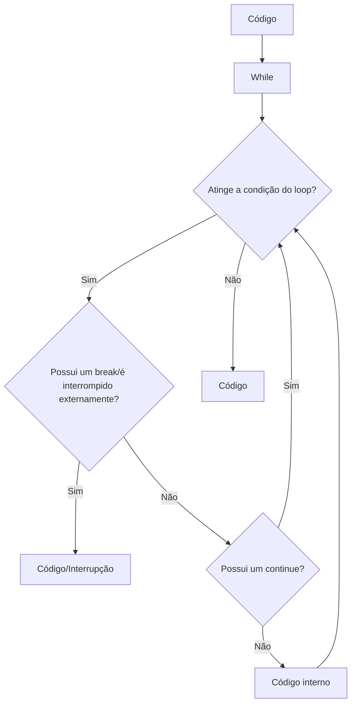
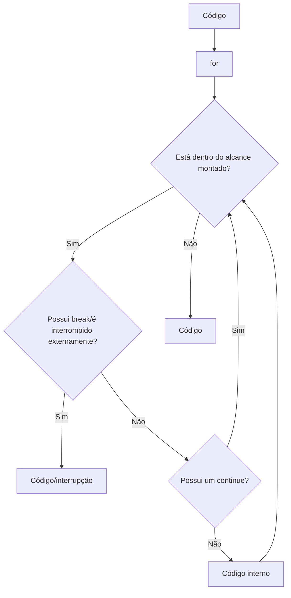

# Loops:

```mermaid
flowchart TD
	A["Código"] --> B["Loop"]
	B --> C{"Encontra um break/é parado externamente?"}
	C -- Sim --> D["Código/interrupção"]
	C -- Não --> E["Código interno"]
	E --> B
```

# While

```mermaid
flowchart TD
	A["Código"] --> B["While"]
	B --> C{"Atinge a condição do loop?"}
	C -- Sim --> D{"Possui um break/é interrompido externamente?"}
	C -- Não --> E["Código"]
	D -- Sim --> F["Código/Interrupção"]
	D -- Não --> G{"Possui um continue?"}
	G -- Sim --> C
	G -- Não --> H["Código interno"]
	H --> C
```
# For

```mermaid
flowchart TD
	A["Código"] --> B["for"]
	B --> C{"Está dentro do alcance montado?"}
	C -- Sim --> D{"Possui break/é interrompido externamente?"}
	C -- Não --> E["Código"]
	D -- Sim --> F["Código/interrupção"]
	D -- Não --> G{"Possui um continue?"}
	G -- Sim --> C
	G -- Não --> H["Código interno"]
	H --> C
```

