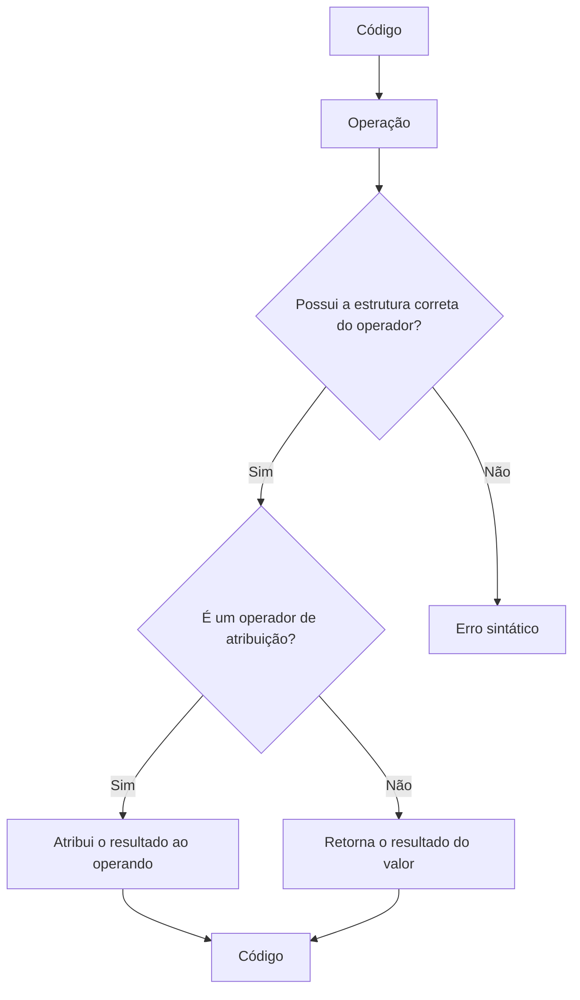

```mermaid
flowchart TD
	A["Código"] --> B["Operação"]
	B --> C{"Possui a estrutura correta do operador?"}
	C -- Sim --> D{"É um operador de atribuição?"}
	C -- Não --> E["Erro sintático"]
	D -- Sim --> F["Atribui o resultado ao operando"]
	D -- Não --> G["Retorna o resultado do valor"]
	F --> H["Código"]
	G --> H["Código"]
```

