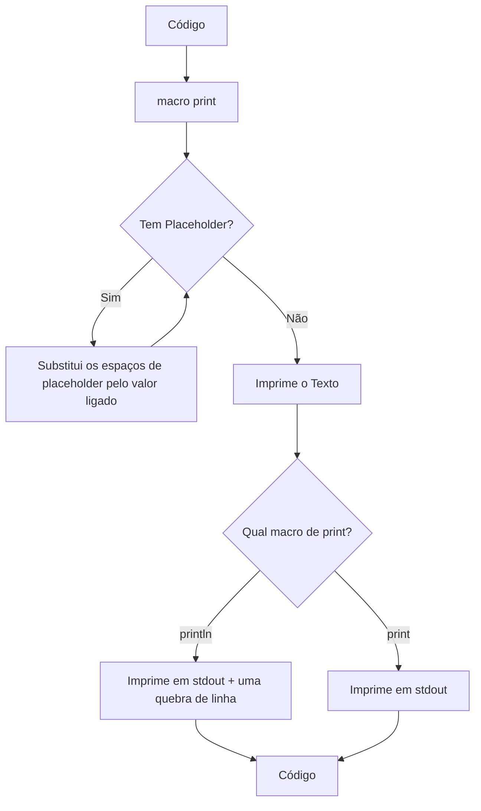

```mermaid
flowchart TD
	A["Código"] --> B["macro print"]
	B --> C{"Tem Placeholder?"}
	C -- Sim --> D["Substitui os espaços de placeholder pelo valor ligado"]
	C -- Não --> E["Imprime o Texto"]
	D --> C
	E --> F{"Qual macro de print?"}
	F -- println --> G["Imprime em stdout + uma quebra de linha"]
	F -- print --> H["Imprime em stdout"]
	G --> I["Código"]
	H --> I
```
