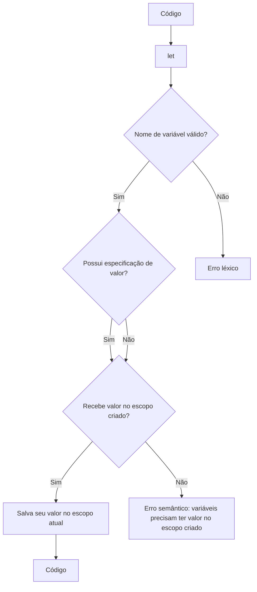
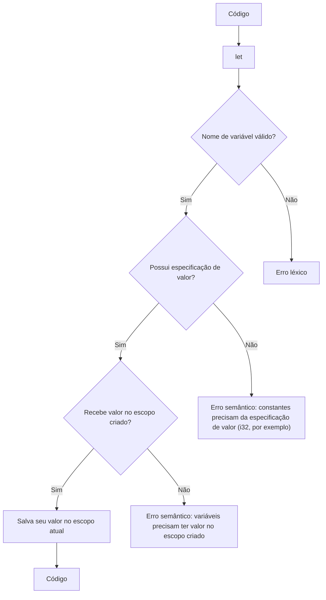

# Variáveis

```mermaid
flowchart TD
	A["Código"] --> B[let]
	B --> C{"Nome de variável válido?"}
	C -- Sim --> D{"Possui especificação de valor?"}
	C -- Não --> E["Erro léxico"]
	D -- Sim --> F{"Recebe valor no escopo criado?"}
	D -- Não --> F
	F -- Sim --> G["Salva seu valor no escopo atual"]
	F -- Não --> H["Erro semântico: variáveis precisam ter valor no escopo criado"]
	G --> I["Código"]
```
# Constantes

```mermaid
flowchart TD
	A["Código"] --> B[let]
	B --> C{"Nome de variável válido?"}
	C -- Sim --> D{"Possui especificação de valor?"}
	C -- Não --> E["Erro léxico"]
	D -- Sim --> F{"Recebe valor no escopo criado?"}
	D -- Não --> G["Erro semântico: constantes precisam da especificação de valor (i32, por exemplo)"]
	F -- Sim --> H["Salva seu valor no escopo atual"]
	F -- Não --> I["Erro semântico: variáveis precisam ter valor no escopo criado"]
	H --> J["Código"]
```

